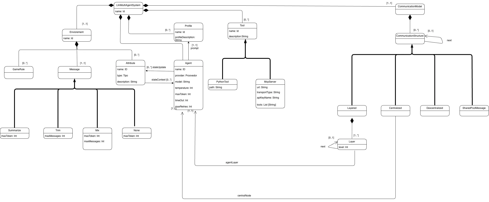

## Metamodelo



## Conceptos del metamodelo

Un sistema multiagente se describe mediante la siguiente estructura raíz (`LLMMultiAgentSystem`):

```
{
  environment ...
  profile ...
  tool ...
  agent ...
  <estructuras de comunicación> ...
}
```

El metamodelo se organiza en cinco bloques principales: **Environment**, **Profile**, **Tool**, **Agent** y **CommunicationStructure**.

---

### `Environment`

Representa el entorno en el que opera el sistema multiagente. Contiene tres sub-conceptos:

#### `GameRule`

Reglas generales del sistema expresadas como descripciones textuales. _Pendiente de desarrollo._

#### `Attribute`

Campos tipados (`int`, `string`, `boolean`) que conforman el estado compartido del sistema. Cada atributo tiene un nombre, un tipo y una descripción obligatoria. Los agentes pueden referenciar estos atributos para leer valores del estado o para actualizar el estado compartido a través de esquemas de salida estructurada.

#### `Message`

Determina la estrategia de gestión del historial de mensajes de los agentes. Existen cuatro opciones:

| Estrategia   | Descripcion                                                                 |
|--------------|-----------------------------------------------------------------------------|
| `trim`       | Recorta el historial conservando solo los últimos N mensajes (`maxMessages`). |
| `summarize`  | Resume el historial cuando supera un umbral de tokens (`maxToken`).          |
| `mix`        | Combina ambas estrategias: limita por tokens (`maxToken`) y por número de mensajes (`maxMessages`). |
| `none`       | No aplica ninguna gestión; se conserva el historial completo.                |

---

### `Profile`

Un perfil define el prompt de sistema que recibe un agente. Tiene un nombre identificador y una descripción textual (`profileDescription`) que constituye el prompt en sí. Varios agentes pueden compartir el mismo perfil, lo que permite reutilizar un mismo prompt en distintos nodos del sistema.

---

### `Agent`

Define un agente individual dentro del sistema. Referencia un `Profile` (su prompt) y declara el modelo LLM que utilizará. Sus atributos se dividen en tres categorías:

**Obligatorios:**

| Atributo   | Descripcion                                                         |
|------------|---------------------------------------------------------------------|
| `model`    | Modelo LLM a utilizar: `gpt`, `claude`, `ollama`, ...                  |
| `profile`  | Referencia al `Profile` que define el prompt de sistema del agente.  |

**Recomendables:**

| Atributo       | Descripcion                                                                                                     |
|----------------|-----------------------------------------------------------------------------------------------------------------|
| `description`  | Descripción textual del propósito del agente dentro del sistema. Sirve como comentario en el código generado.                                                |
| `stateContext` | Referencias a `Attribute`s del entorno cuyos valores se inyectan en el contexto del agente (lectura del estado). |
| `stateUpdate`  | Referencias a `Attribute`s del entorno que el agente puede modificar mediante salida estructurada (escritura del estado). |

**Opcionales:**

| Atributo      | Descripcion                                                        |
|---------------|--------------------------------------------------------------------|
| `temperature` | Controla la aleatoriedad de las respuestas del modelo.              |
| `maxToken`    | Límite máximo de tokens en la respuesta generada.                   |
| `timeOut`     | Tiempo máximo de espera (en segundos) para la respuesta del modelo. |
| `maxRetries`  | Número máximo de reintentos ante fallos de la llamada al modelo.    |
| `tools`       | Lista de herramientas (`Tool`) que el agente puede invocar.         |

---

### `Tool`

Define herramientas que los agentes pueden utilizar para interactuar con sistemas externos. Todas las herramientas comparten una base común (`ToolBase`): nombre, descripción y parámetros opcionales tipados (`Param`). Existen tres tipos:

#### `PythonTool`

Herramienta implementada como un módulo Python local. Además de la base común, requiere la ruta al módulo (`modulePath`).

#### `MCPTool`

Herramienta que conecta con un servidor MCP (Model Context Protocol) remoto. Define la URL del servidor (`serverUrl`), el tipo de transporte (`transport`) y, opcionalmente, una clave de autenticación (`key`).

#### `EndPointTool`

Herramienta que invoca un endpoint REST. Define la URL del endpoint (`url`) y el método HTTP (`method`: `GET`, `POST`, `PUT` o `DELETE`).

---

### `CommunicationStructure`

Define cómo se organizan y comunican los agentes entre sí. Cualquier estructura puede encadenarse con otra mediante el atributo opcional `next`, lo que permite componer flujos de comunicación secuenciales. Existen cuatro estructuras:

#### `Layered`

Organización jerárquica en capas. Cada `Layer` tiene un nombre, un nivel numérico (`level`), una referencia al agente que opera en ella y una referencia opcional a la siguiente capa (`next`).

#### `Centralized`

Un agente coordinador central (`coordinator`) gestiona la comunicación entre los demás agentes.

#### `SharedMessagePool`

Todos los agentes comparten un pool de mensajes común, sin jerarquía ni coordinador.

#### `Decentralized`

Comunicación directa entre agentes sin coordinación central ni pool compartido.
